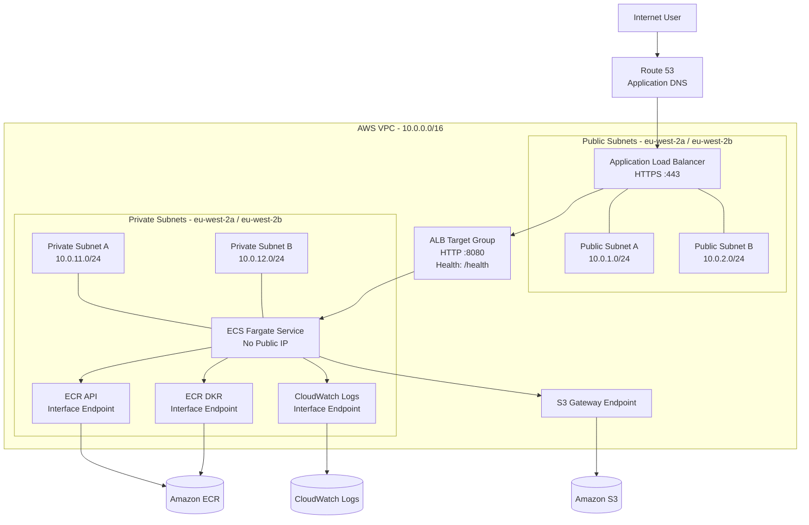
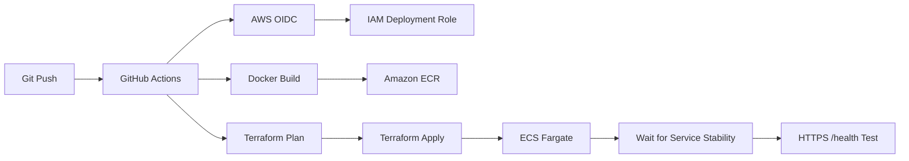

# IT Tools — AWS ECS Fargate Platform

Production-style deployment of the open-source **IT Tools** application on AWS using Docker, Amazon ECS Fargate, Terraform and GitHub Actions.

The project was built progressively: first running the application locally, then containerising it, deploying it manually to AWS, rebuilding the architecture with Terraform, and finally automating deployments through GitHub Actions using AWS OIDC.

The final architecture places the public Application Load Balancer in two public subnets while ECS Fargate workloads run inside two private subnets with:

- no public IP addresses
- no NAT Gateway
- private AWS connectivity through VPC endpoints
- HTTPS using Route 53 and AWS Certificate Manager
- immutable Git-SHA container images
- remote Terraform state
- keyless GitHub Actions authentication
- automated deployment health checks
- automated infrastructure teardown and verification

**Demo:**
<video controls src="docs/images/Recording 2026-09-10 163416.mp4" title="Title"></video>


> **Project status:** Successfully deployed and validated over HTTPS through both Terraform and GitHub Actions. The AWS project infrastructure was subsequently destroyed to avoid unnecessary ongoing costs.

---

## Project Overview

The purpose of this project was not to build the IT Tools application itself.

Instead, the goal was to take an existing application and build the infrastructure, containerisation, networking, security and deployment processes required to operate it on AWS.

The project demonstrates practical experience with:

| Area | Technology |
|---|---|
| Cloud | AWS |
| Containers | Docker |
| Container Registry | Amazon ECR |
| Container Runtime | Amazon ECS Fargate |
| Infrastructure as Code | Terraform |
| CI/CD | GitHub Actions |
| AWS Authentication | GitHub OIDC |
| Networking | VPC, subnets, route tables, security groups |
| Private Connectivity | AWS VPC Endpoints |
| Load Balancing | Application Load Balancer |
| DNS | Amazon Route 53 |
| TLS | AWS Certificate Manager |
| Logging | Amazon CloudWatch Logs |
| Terraform State | Amazon S3 |
| Web Server | Nginx |
| Application | Vue / Vite / IT Tools |

---

# Architecture



---

## Multi-AZ Design

The platform uses two public and two private subnets across:

```text
eu-west-2a
eu-west-2b
```

The Application Load Balancer spans both public subnets.

The ECS service is configured to use both private subnets, allowing Fargate tasks to be scheduled across both Availability Zones.

The demonstrated CI/CD deployment used:

```text
desired_count = 1
```

to keep portfolio infrastructure costs lower.

The service can be scaled to two or more tasks to take greater advantage of the multi-AZ design.

A future production improvement would be to run at least two tasks and explicitly maintain workload distribution across Availability Zones.

---

# Network Design

## Public Layer

The public subnets contain the internet-facing Application Load Balancer.

The public route table contains:

```text
0.0.0.0/0 → Internet Gateway
```

The Application Load Balancer accepts public HTTP and HTTPS traffic.

HTTP requests are redirected to HTTPS.

---

## Private Application Layer

ECS Fargate tasks run exclusively inside the private subnets.

Terraform configures:

```hcl
assign_public_ip = false
```

The private route table deliberately has no:

```text
0.0.0.0/0 → Internet Gateway
```

and no NAT Gateway is deployed.

The Fargate tasks therefore do not have direct public internet connectivity.

---

# Private AWS Connectivity

Although the application tasks are private, ECS still requires access to AWS services during startup.

For example:

```text
ECR → retrieve the container image
S3  → retrieve ECR image layers
CloudWatch Logs → send container logs
```

Instead of routing this traffic through a NAT Gateway, the project uses VPC endpoints.

| AWS Service | Endpoint Type |
|---|---|
| ECR API | Interface |
| ECR DKR | Interface |
| CloudWatch Logs | Interface |
| Amazon S3 | Gateway |

This allows AWS service traffic to remain on private AWS networking while the ECS tasks remain without public IP addresses.

The application itself is a static frontend served by Nginx and therefore does not require arbitrary outbound internet connectivity from the Fargate task.

---

# Security Groups

The platform uses security-group references rather than broad CIDR-based rules between internal components.

## Application Load Balancer

Inbound:

```text
Internet → TCP 80
Internet → TCP 443
```

Outbound:

```text
ALB Security Group → ECS Security Group :8080
```

## ECS Fargate

Inbound:

```text
ALB Security Group → ECS Security Group :8080
```

Outbound:

```text
ECS Security Group → VPC Endpoint Security Group :443
ECS Security Group → S3 AWS Prefix List :443
```

## Interface VPC Endpoints

Inbound:

```text
ECS Security Group → Endpoint Security Group :443
```

The application container is therefore not directly exposed to the internet.

Public traffic must travel through:

```text
Internet
   ↓
Route 53
   ↓
Application Load Balancer
   ↓
Target Group
   ↓
ECS Fargate
```

---

# Project Build Journey

## Stage 1 — Local Application

I first ran IT Tools locally before introducing Docker or AWS.

This allowed application-level issues to be separated from later container and infrastructure issues.

The application uses:

```text
Node.js 18.18.2
pnpm 9.11.0
Vue
Vite
```

The application was successfully built and served locally before continuing.

---

# Stage 2 — Docker Containerisation

The application is packaged using a multi-stage Docker build.

## Build Stage

```dockerfile
FROM node:18.18.2-alpine AS builder

ENV NPM_CONFIG_LOGLEVEL=warn
ENV CI=true

WORKDIR /app

RUN corepack enable \
    && corepack prepare pnpm@9.11.0 --activate

COPY package.json pnpm-lock.yaml ./
RUN pnpm install --frozen-lockfile

COPY . .
RUN pnpm build
```

The build stage:

```text
Installs dependencies
        ↓
Builds the Vue/Vite application
        ↓
Produces /app/dist
```

---

## Runtime Stage

```dockerfile
FROM nginxinc/nginx-unprivileged:stable-alpine AS runtime

COPY --from=builder /app/dist /usr/share/nginx/html
COPY nginx.conf /etc/nginx/conf.d/default.conf

EXPOSE 8080

CMD ["nginx", "-g", "daemon off;"]
```

Only the compiled frontend is copied into the runtime image.

The production image therefore does not require the Node.js build environment.

The runtime also uses:

```text
nginxinc/nginx-unprivileged
```

rather than running Nginx as root.

During local testing the container was verified to be running as the Nginx non-root user.

---

## Docker Validation

Example local build:

```bash
docker build -t it-tools:local ./app
```

Run:

```bash
docker run --rm -p 8080:8080 it-tools:local
```

Application:

```bash
curl -I http://localhost:8080
```

Health endpoint:

```bash
curl http://localhost:8080/health
```

Expected response:

```json
{"status":"ok"}
```

---

# Health Check

A dedicated health endpoint is provided by Nginx:

```nginx
location = /health {
    default_type application/json;
    return 200 '{"status":"ok"}';
}
```

The same health contract is used across the platform.

```text
Local Docker testing
        ↓
ALB Target Group
        ↓
ECS deployment
        ↓
GitHub Actions validation
```

This allows the deployment pipeline to verify the application itself rather than only checking whether AWS resources were created.

---

# Stage 3 — Manual AWS Deployment

Before building the Terraform version, I manually deployed the application to AWS.

This was intentional.

The purpose was to understand the individual AWS components and traffic flow before translating them into Infrastructure as Code.

The manual deployment included:

```text
Docker Image
     ↓
Amazon ECR
     ↓
ECS Fargate
     ↓
Application Load Balancer
     ↓
Route 53
     ↓
AWS Certificate Manager
     ↓
HTTPS Application
```

---

## Manual Container Registry

An Amazon ECR repository was created and the locally built Docker image was tagged and pushed to AWS.

This validated:

```text
Docker build
    ↓
ECR authentication
    ↓
Docker tag
    ↓
Docker push
```

---

## Manual ECS Deployment

The first deployment used the AWS default VPC.

Fargate tasks were placed in public subnets with:

```text
assignPublicIp = ENABLED
```

This was intentionally simpler than the final architecture.

The initial goal was to prove the complete application path before introducing private networking.

The manual deployment created:

```text
ECR repository
ECS cluster
ECS task definition
ECS service
Task execution IAM role
CloudWatch log group
ALB security group
ECS security group
Application Load Balancer
Target group
HTTP listener
HTTPS listener
ACM certificate
Route 53 DNS record
```

---

## Manual Load Balancer

The ALB target group used:

```text
Protocol: HTTP
Port: 8080
Target type: IP
Health path: /health
Matcher: 200
```

The public DNS name used during the project was:

```text
it-tools.twrz.co.uk
```

The application was successfully validated over HTTPS:

```bash
curl https://it-tools.twrz.co.uk/health
```

Response:

```json
{"status":"ok"}
```

---

## Why Deploy Manually First?

The manual build helped establish how:

```text
ECR
ECS
Fargate
IAM
ALB
Target Groups
Security Groups
Route 53
ACM
CloudWatch
```

work together before Terraform was introduced.

After validating the manual architecture, the project-specific resources were removed and the architecture was rebuilt using Terraform.

---

# Stage 4 — Terraform Redesign

The Terraform architecture improved the original manual deployment.

The main change was moving Fargate workloads from public networking into dedicated private subnets.

```text
Manual Architecture

Public ECS tasks
Public task IPs
Default VPC

        ↓ redesigned into ↓

Terraform Architecture

Dedicated VPC
Public ALB
Private ECS tasks
No task public IP
No NAT Gateway
VPC endpoints
Explicit security-group paths
```

---

# Terraform Structure

Terraform is separated into two independent roots:

```text
it-tools-ecs-platform/
│
├── bootstrap/
│
└── infra/
```

This separation solves the Terraform bootstrap dependency problem.

---

## Bootstrap Infrastructure

`bootstrap/` creates infrastructure that must exist before the main deployment can run.

```text
bootstrap/
│
├── S3 Terraform state bucket
├── GitHub OIDC provider
├── GitHub Actions IAM role
├── GitHub Actions IAM policy
└── Amazon ECR repository
```

These resources are required before GitHub Actions can deploy `infra/`.

---

## Why Bootstrap Is Separate

The main deployment needs:

```text
Remote Terraform state
        +
AWS authentication
        +
ECR repository
```

But GitHub Actions cannot create those resources if it already depends on them.

Therefore:

```text
Local Terraform
      ↓
bootstrap/
      ↓
S3 + ECR + OIDC + IAM
      ↓
GitHub Actions
      ↓
infra/
      ↓
Application Infrastructure
```

---

# Terraform Remote State

The main Terraform stack stores state remotely in Amazon S3.

The state bucket is configured with:

```text
Versioning
Server-side AES256 encryption
Public access blocking
```

The main backend uses:

```hcl
terraform {
  backend "s3" {
    key          = "infra/terraform.tfstate"
    region       = "eu-west-2"
    encrypt      = true
    use_lockfile = true
  }
}
```

This allows local Terraform and GitHub Actions to work from the same infrastructure state.

---

# Main Terraform Infrastructure

`infra/` provisions the application stack.

```text
VPC
├── Internet Gateway
├── Public Subnet A
├── Public Subnet B
├── Private Subnet A
├── Private Subnet B
├── Public Route Table
├── Private Route Table
├── ECR API Endpoint
├── ECR DKR Endpoint
├── CloudWatch Logs Endpoint
└── S3 Gateway Endpoint

Security
├── ALB Security Group
├── ECS Security Group
├── Endpoint Security Group
└── ECS Task Execution IAM Role

Application
├── ECS Cluster
├── ECS Task Definition
├── ECS Fargate Service
├── Application Load Balancer
└── Target Group

Observability
└── CloudWatch Log Group

DNS / TLS
├── ACM Certificate
├── ACM DNS Validation
└── Route 53 Application Record
```

---

# Route 53 and ACM

The project does **not** create or own the parent Route 53 hosted zone.

Instead, Terraform looks up an existing hosted zone using a data source.

For the original deployment:

```text
Hosted zone: twrz.co.uk
Application: it-tools.twrz.co.uk
```

Terraform then creates only the project-specific records required for:

```text
ACM certificate validation
Application ALB alias
```

This is important because the parent hosted zone is a shared resource and must not be deleted during project teardown.

---

# CloudWatch Logging

The project provisions:

```text
CloudWatch Log Group
        +
ECS awslogs configuration
        +
ECS Task Execution IAM Role
        +
CloudWatch Logs VPC Endpoint
```

The Terraform-managed log group is:

```text
/ecs/it-tools
```

with a seven-day retention period.

The final ECS container definition uses:

```hcl
logConfiguration = {
  logDriver = "awslogs"

  options = {
    "awslogs-group"         = aws_cloudwatch_log_group.ecs.name
    "awslogs-region"        = var.aws_region
    "awslogs-stream-prefix" = local.project_name
  }
}
```

This configures ECS to send container stdout/stderr through the `awslogs` driver.

The CloudWatch Logs VPC endpoint allows that traffic to remain private.

---

# Stage 5 — GitHub Actions CI/CD

Deployment is automated using GitHub Actions.



---

## Deployment Workflow

The deployment workflow performs:

```text
Checkout repository
        ↓
Authenticate to AWS through OIDC
        ↓
Login to Amazon ECR
        ↓
Check whether SHA image already exists
        ↓
Build Docker image when required
        ↓
Push image to ECR
        ↓
Terraform init
        ↓
Terraform plan
        ↓
Terraform apply
        ↓
Wait for ECS service stability
        ↓
Test HTTPS /health
```

A successful GitHub Actions deployment was completed as part of the project.

---

# Keyless AWS Authentication

The CI/CD pipeline does not store long-lived AWS access keys.

Instead, GitHub Actions authenticates using OpenID Connect.

```text
GitHub Actions
       ↓
OIDC Token
       ↓
AWS IAM OIDC Provider
       ↓
sts:AssumeRoleWithWebIdentity
       ↓
Project Deployment Role
       ↓
AWS
```

This avoids storing credentials such as:

```text
AWS_ACCESS_KEY_ID
AWS_SECRET_ACCESS_KEY
```

inside GitHub.

---

# OIDC Troubleshooting

The first OIDC deployment failed with:

```text
Not authorized to perform sts:AssumeRoleWithWebIdentity
```

Rather than replacing OIDC with static AWS credentials, I inspected the identity claims presented by GitHub Actions.

The `sub` claim generated for the repository differed from the original trust-policy assumption.

The IAM trust relationship was updated to match the repository identity GitHub actually presented.

After correcting the trust condition, GitHub Actions successfully assumed the AWS deployment role.

This was one of the key troubleshooting exercises in the project.

---

# Immutable Docker Image Versions

Docker images are tagged using the full Git commit SHA.

Example concept:

```text
Git Commit
    ↓
ca54d2e3c...
    ↓
Docker Image Tag
    ↓
Amazon ECR
    ↓
ECS Task Definition
```

This provides traceability between:

```text
Source Code
    ↓
Git Commit
    ↓
Docker Image
    ↓
ECS Deployment
```

The ECR repository uses:

```text
image_tag_mutability = IMMUTABLE
```

and:

```text
scan_on_push = true
```

---

## Idempotent Image Deployment

Immutable tags introduced another CI/CD problem.

Re-running the same commit would attempt to push the same SHA tag again.

The workflow therefore checks ECR first:

```text
Does SHA image exist?
       │
   ┌───┴────┐
  Yes       No
   │         │
Reuse     Build image
image        ↓
          Push ECR
```

This allows failed or interrupted workflow runs to be retried without attempting to overwrite immutable image tags.

---

# Deployment Health Validation

A successful Terraform apply does not necessarily mean the application is usable.

For that reason, GitHub Actions performs application-level validation after deployment.

The workflow:

```text
Waits for ECS service stability
        ↓
Waits for ALB target registration
        ↓
Calls HTTPS /health
        ↓
Requires exact response
```

Expected:

```json
{"status":"ok"}
```

This verifies the complete application path:

```text
Route 53
   ↓
HTTPS
   ↓
ACM
   ↓
Application Load Balancer
   ↓
Target Group
   ↓
ECS Service
   ↓
Fargate Task
   ↓
Nginx
   ↓
/health
```

---

# Terraform Partial Apply Recovery

One useful Terraform troubleshooting exercise occurred while building the network.

An incorrect route CIDR was initially entered as:

```text
0.0.0/0
```

instead of:

```text
0.0.0.0/0
```

Terraform had already created several resources before reaching the invalid configuration.

After correcting the CIDR and running Terraform again, Terraform reconciled its existing state and created only the remaining resources.

This demonstrated an important Terraform concept:

> Terraform state allows infrastructure creation to continue from the known current state rather than blindly rebuilding everything after a partial failure.

---

# Infrastructure Teardown

Operating cloud infrastructure responsibly also means being able to remove it safely.

The project therefore includes:

```text
scripts/destroy.sh
scripts/verify-destroy.sh
```

---

## Automated Destroy

Run:

```bash
./scripts/destroy.sh
```

The script requires two explicit confirmations before destruction begins.

It then destroys infrastructure in this order:

```text
1. Main application infrastructure
               ↓
2. Bootstrap infrastructure
               ↓
3. Independent AWS verification
```

The order is important.

`infra/` must be destroyed while the S3 remote Terraform state still exists.

Only once the main stack is removed can `bootstrap/` safely destroy:

```text
ECR
GitHub OIDC
GitHub Actions IAM
Terraform state bucket
```

---

# Shared Resources Are Protected

The teardown process only targets resources owned by this project.

Resources such as the existing Route 53 hosted zone are deliberately not Terraform-managed project resources.

The teardown leaves shared or unrelated infrastructure untouched.

For example:

```text
Shared Route 53 hosted zone → retained
Default AWS VPC             → retained
Unrelated portfolio apps    → retained
```

---

# Post-Destroy Verification

After Terraform finishes, `verify-destroy.sh` performs direct AWS API checks.

It verifies the removal of:

```text
ECS cluster
Application Load Balancer
Project VPC
VPC endpoints
CloudWatch log group
ECR repository
GitHub Actions IAM role
GitHub OIDC provider
Terraform state bucket
Route 53 application record
ACM certificate
```

---

## AWS Tagging API Eventual Consistency

During teardown testing, the AWS Resource Groups Tagging API continued returning ARNs for resources that had already been deleted.

Examples included:

```text
deleted VPC endpoints
inactive ECS historical records
```

Direct service-specific API calls confirmed that these resources no longer existed.

The verifier was therefore changed so that:

```text
Service-specific APIs → authoritative checks

Tagging API → informational catch-all
```

This prevents stale tagging metadata from incorrectly reporting a failed teardown.

---

# Final Project Lifecycle

The complete project lifecycle became:

```text
IT Tools application
        ↓
Local build
        ↓
Docker container
        ↓
Manual AWS deployment
        ↓
Manual validation
        ↓
Manual teardown
        ↓
Terraform architecture
        ↓
Private ECS networking
        ↓
VPC endpoints
        ↓
Route 53 + ACM
        ↓
GitHub OIDC
        ↓
GitHub Actions CI/CD
        ↓
Immutable SHA deployments
        ↓
HTTPS health validation
        ↓
Automated Terraform teardown
        ↓
Independent AWS verification
```

---

# Repository Structure

```text
it-tools-ecs-platform/
│
├── .github/
│   └── workflows/
│       └── deploy.yml
│
├── app/
│   ├── Dockerfile
│   ├── .dockerignore
│   ├── nginx.conf
│   ├── LICENSE
│   └── application source
│
├── bootstrap/
│   ├── ecr.tf
│   ├── github-oidc.tf
│   ├── github-role.tf
│   ├── locals.tf
│   ├── outputs.tf
│   ├── providers.tf
│   ├── state.tf
│   ├── variables.tf
│   └── versions.tf
│
├── infra/
│   ├── alb.tf
│   ├── backend.tf
│   ├── data.tf
│   ├── dns.tf
│   ├── ecs.tf
│   ├── iam.tf
│   ├── locals.tf
│   ├── logs.tf
│   ├── network.tf
│   ├── outputs.tf
│   ├── providers.tf
│   ├── security.tf
│   ├── variables.tf
│   └── versions.tf
│
├── scripts/
│   ├── destroy.sh
│   └── verify-destroy.sh
│
├── .gitignore
└── README.md
```

---

# Reproducing the Project

> **Warning:** Deploying this project creates billable AWS resources including an Application Load Balancer, VPC interface endpoints and ECS Fargate workloads.

The repository contains environment-specific values from my original AWS deployment.

It should **not** be cloned and applied without first changing those values for the target environment.

---

## Values That Must Be Changed

Before deploying into another AWS account or GitHub repository, review and update:

```text
Route 53 hosted zone
Application domain
Terraform S3 state bucket name
GitHub repository / OIDC subject
AWS region if required
GitHub repository variables
Any environment-specific resource names
```

In particular, review:

```text
infra/dns.tf
bootstrap/variables.tf
bootstrap/github-role.tf
.github/workflows/deploy.yml
scripts/destroy.sh
scripts/verify-destroy.sh
```

Do not reuse my hosted zone, state bucket name or GitHub OIDC repository identity as though they are generic configuration.

These identifiers are not passwords or AWS credentials, but they identify the environment for which this implementation was originally created.

---

# Prerequisites

Install and configure:

```text
Git
Docker
AWS CLI
Terraform
GitHub repository
AWS account
Route 53 hosted zone / domain
```

AWS CLI authentication is required for the initial bootstrap deployment.

---

# 1. Clone Repository

```bash
git clone https://github.com/CloudRizz/it-tools-ecs-platform.git
cd it-tools-ecs-platform
```

---

# 2. Update Environment-Specific Configuration

At minimum, replace:

```text
twrz.co.uk
it-tools.twrz.co.uk
Terraform state bucket name
GitHub OIDC repository identity
AWS region if different
```

with values belonging to your own environment.

---

# 3. Deploy Bootstrap

```bash
cd bootstrap

terraform init
terraform plan
terraform apply
```

Retrieve the bootstrap outputs:

```bash
terraform output
```

These provide values for:

```text
Terraform state bucket
GitHub Actions IAM role
ECR repository
```

---

# 4. Configure GitHub Repository Variables

Create repository variables for:

```text
AWS_REGION
AWS_ROLE_ARN
ECR_REPOSITORY_URL
TF_STATE_BUCKET
```

These are configuration values rather than long-lived AWS credentials.

---

# 5. Initialise Main Terraform Backend

```bash
cd ../infra

terraform init \
  -backend-config="bucket=<YOUR_STATE_BUCKET>"
```

The project is designed for the main infrastructure deployment to be performed through GitHub Actions after bootstrap has been created.

---

# 6. Deploy Through GitHub Actions

Push an application, infrastructure or workflow change to `main`.

The deployment workflow is path-filtered to changes affecting:

```text
app/**
infra/**
.github/workflows/deploy.yml
```

Documentation-only or teardown-script changes therefore do not unnecessarily redeploy the application.

---

# Destroying the Deployment

From the repository root:

```bash
./scripts/destroy.sh
```

The script will:

```text
Destroy infra/
      ↓
Destroy bootstrap/
      ↓
Run verify-destroy.sh
```

The environment can also be checked independently using:

```bash
./scripts/verify-destroy.sh
```

---

# Security Decisions Already Implemented

The project already incorporates several security controls:

```text
Private ECS tasks
No public task IPs
No NAT-based general outbound path
Restricted security-group references
HTTPS-only public application traffic
HTTP → HTTPS redirect
ACM-managed TLS
Non-root Nginx runtime
GitHub OIDC authentication
No long-lived AWS keys in GitHub
Immutable ECR image tags
ECR scan-on-push
Encrypted Terraform state
Blocked public access to Terraform state
Private ECR / CloudWatch connectivity
S3 Gateway Endpoint
Separate ECS task execution role
```

---

# Future Improvements and Security Hardening

The current project is deliberately a production-style portfolio implementation rather than a complete enterprise platform.

The following improvements would make the architecture stronger.

## High Availability

Increase:

```text
desired_count = 1
```

to:

```text
desired_count = 2
```

and maintain task distribution across the two Availability Zones.

This would allow the service to continue operating if a single task or Availability Zone becomes unavailable.

---

## ECS Deployment Circuit Breaker

Enable the ECS deployment circuit breaker with automatic rollback.

This would allow ECS to detect unsuccessful deployments and automatically return to the last working task definition.

---

## Least-Privilege CI/CD IAM

The GitHub Actions deployment role is dedicated to this project, but several service permissions remain broad.

For example, the role currently requires broad access across AWS services used by Terraform.

A production hardening exercise would replace broad actions such as:

```text
ec2:*
ecs:*
ecr:*
route53:*
```

with the exact actions and resource scopes required by the deployment.

---

## Protected GitHub Environment

Introduce a GitHub production environment.

This could require manual approval before:

```text
terraform apply
```

and allow the AWS OIDC trust policy to be further restricted to that environment.

---

## Branch Protection

Protect `main` by requiring:

```text
Pull requests
Required status checks
No direct pushes
Review before merge
```

This is particularly important because changes reaching the deployment workflow can assume an AWS IAM role.

---

## Terraform CI Checks

Run validation before deployment:

```bash
terraform fmt -check
terraform validate
```

Potential additional tooling:

```text
TFLint
Checkov
tfsec
```

This would catch formatting, Terraform and security problems before `terraform apply`.

---

## Container Vulnerability Scanning

ECR scan-on-push is already enabled.

An additional pipeline stage could use tools such as:

```text
Trivy
```

and fail the deployment when critical vulnerabilities are detected.

---

## Pin GitHub Actions

Pin third-party GitHub Actions to immutable commit SHAs instead of only major-version tags.

This reduces software-supply-chain risk if an upstream action tag changes.

---

## Pin Terraform Version in CI

The Terraform configuration requires Terraform 1.16 or later.

The GitHub Actions workflow could explicitly install the project-tested Terraform version rather than requesting the latest available version.

---

## Saved Terraform Plans

The current workflow performs:

```text
terraform plan
        ↓
terraform apply
```

as separate Terraform operations.

A stronger pipeline would generate:

```bash
terraform plan -out=tfplan
```

and then apply exactly that artifact:

```bash
terraform apply tfplan
```

This guarantees that the reviewed plan is the same plan that is deployed.

---

## Application Load Balancer Access Logs

Enable ALB access logging to an S3 bucket.

This would provide request-level information useful for:

```text
Auditing
Traffic analysis
Security investigation
Troubleshooting
```

---

## VPC Flow Logs

Enable VPC Flow Logs for visibility into network traffic entering and leaving the project VPC.

This would improve troubleshooting and security monitoring.

---

## CloudWatch Monitoring and Alerts

Add CloudWatch alarms for metrics such as:

```text
ALB 5xx responses
Unhealthy targets
ECS CPU usage
ECS memory usage
Task count
```

Notifications could be delivered through Amazon SNS.

---

## AWS WAF

Attach AWS WAF to the internet-facing Application Load Balancer.

AWS managed rules could protect the public endpoint against common web attack patterns.

---

## Container Runtime Hardening

The application already uses an unprivileged Nginx runtime.

Further container hardening could include:

```text
Read-only root filesystem
Dropping unnecessary Linux capabilities
Explicit ECS container health checks
Additional image vulnerability gates
```

---

## VPC Endpoint Policies

Add endpoint policies to restrict which AWS resources can be accessed through the private VPC endpoints.

This would add another layer of control beyond security groups.

---

## ECR Lifecycle Policy

Commit-SHA image tagging can create many ECR images over time.

An ECR lifecycle policy could automatically remove older images after a defined retention period.

---

# Key Learning Outcomes

This project provided hands-on experience with the full lifecycle of an AWS container platform.

Rather than only provisioning resources individually, I worked through:

```text
Application validation
Containerisation
Manual deployment
AWS networking
Private workloads
IAM
DNS
TLS
Load balancing
Infrastructure as Code
Remote Terraform state
CI/CD
OIDC
Deployment troubleshooting
Application health verification
Infrastructure teardown
Post-destroy validation
```

The most useful aspect of the project was seeing how each layer interacts with the others.

For example:

```text
A private ECS task cannot simply pull from ECR
        ↓
ECR requires private service connectivity
        ↓
ECR image layers require S3
        ↓
CloudWatch logging requires its own connectivity
        ↓
Security groups must allow only those paths
```

That transformed the project from simply "running a Docker container on ECS" into designing and troubleshooting the complete platform around it.

---

# Evidence

The project was validated at multiple stages, including:

```text
Local Vue/Vite application
Local Docker container
Non-root container user
Local /health endpoint
ECR image push
Manual ECS deployment
Healthy ALB target
HTTPS application access
Terraform plan/apply
Private ECS deployment
GitHub OIDC role assumption
GitHub Actions deployment
Commit-SHA image deployment
Successful HTTPS health validation
Automated Terraform destroy
Post-destroy AWS verification
```

Screenshots from these stages can be stored under:

```text
docs/images/
```

and referenced throughout this README as deployment evidence.

---

# Application Credit

This project uses the open-source **IT Tools** application by Corentin Thomasset as the workload:

https://github.com/CorentinTh/it-tools

I did not create the IT Tools application itself.

My work in this repository focuses on:

```text
Containerisation
AWS architecture
Networking
Security
Terraform
CI/CD
Deployment
Operational validation
Infrastructure teardown
```

The upstream GPLv3 licence is retained within the `app/` directory.

---

# Author

**Rizwan Hussain**

Cloud / DevOps Engineer

GitHub: https://github.com/CloudRizz