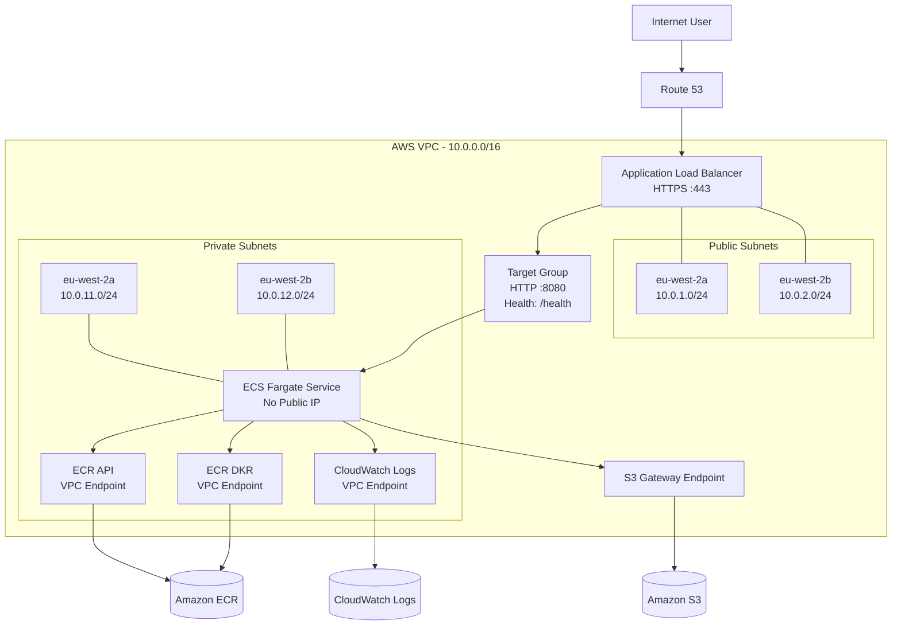
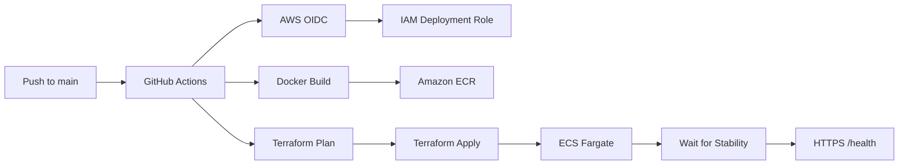

# IT Tools — AWS ECS Fargate Platform

A hands-on AWS and DevOps project where I took an existing open-source application and built the platform required to run it securely on AWS.

The application runs as a Docker container on **Amazon ECS Fargate**, behind an **Application Load Balancer**, with the Fargate tasks isolated inside **private subnets**.

The infrastructure is managed with **Terraform**, while deployments are automated through **GitHub Actions using AWS OIDC** — meaning no long-lived AWS access keys are stored in GitHub.

This project wasn't just about getting a container running. I wanted to understand and build the complete path from source code to a working production-style deployment:

```text
Application
    ↓
Docker
    ↓
Amazon ECR
    ↓
ECS Fargate
    ↓
Application Load Balancer
    ↓
Route 53 + HTTPS
    ↓
Users
```

I first deployed the application manually to understand how the AWS components worked together. I then tore that environment down, redesigned it with private networking, rebuilt it using Terraform and finally automated the deployment through GitHub Actions.

> **Project status:** Successfully deployed and validated end-to-end through GitHub Actions. The AWS infrastructure is destroyed after testing to avoid unnecessary ongoing cloud costs.

---

## Demo

https://github.com/user-attachments/assets/fa1489bc-1522-47a4-ad0d-b8080ce39ef7


The deployed application was available at:

```text
https://it-tools.twrz.co.uk
```

A dedicated health endpoint was also exposed:

```text
https://it-tools.twrz.co.uk/health
```

Successful response:

```json
{"status":"ok"}
```

---

# What I Built

The final platform includes:

- Dockerised Vue/Vite application
- Multi-stage Docker build
- Non-root Nginx runtime
- Custom AWS VPC
- Two Availability Zones
- Public and private subnets
- Private ECS Fargate workloads
- No public IP addresses on ECS tasks
- No NAT Gateway
- Private AWS connectivity through VPC endpoints
- Amazon ECR container registry
- Application Load Balancer
- Route 53 DNS
- ACM-managed HTTPS
- CloudWatch container logging
- Terraform Infrastructure as Code
- Remote Terraform state in Amazon S3
- GitHub Actions CI/CD
- GitHub OIDC authentication to AWS
- Immutable Git-SHA container images
- Automated deployment health validation
- Automated infrastructure teardown
- Post-destroy AWS verification

---

# Architecture



## Architecture at a Glance

| Layer | Implementation |
|---|---|
| Application | IT Tools / Vue / Vite |
| Container | Docker |
| Web Server | Nginx |
| Registry | Amazon ECR |
| Compute | Amazon ECS Fargate |
| Networking | Custom VPC |
| Load Balancing | Application Load Balancer |
| DNS | Amazon Route 53 |
| TLS | AWS Certificate Manager |
| Private AWS Access | VPC Endpoints |
| Logging | Amazon CloudWatch Logs |
| Infrastructure | Terraform |
| Terraform State | Amazon S3 |
| CI/CD | GitHub Actions |
| AWS Authentication | GitHub OIDC |

---

# Key Engineering Decisions

## Private ECS Tasks

One of the main improvements between the first manual deployment and the final Terraform architecture was moving the application workloads into private subnets.

The final ECS service uses:

```hcl
assign_public_ip = false
```

The Fargate tasks therefore have no public IP address and cannot be contacted directly from the internet.

Public traffic must travel through:

```text
Internet
    ↓
Route 53
    ↓
Application Load Balancer
    ↓
Target Group
    ↓
ECS Fargate
```

Only the Application Load Balancer is internet-facing.

---

## No NAT Gateway

A normal private-subnet architecture often uses a NAT Gateway so workloads can reach external services.

For this workload I deliberately avoided one.

The application is a static frontend served by Nginx and does not require arbitrary outbound internet connectivity from the Fargate task.

However, ECS still needs private access to AWS services to:

- retrieve container images from ECR
- retrieve ECR image layers from S3
- send container logs to CloudWatch

I therefore used VPC endpoints instead.

| Service | Endpoint |
|---|---|
| ECR API | Interface |
| ECR DKR | Interface |
| CloudWatch Logs | Interface |
| Amazon S3 | Gateway |

This allows the workload to remain private without providing a general outbound internet route.

It was also a useful networking exercise because simply placing ECS in a private subnet is not enough — all of the services required during task startup still need reachable network paths.

---

# Network Security

I used security-group references between components rather than opening internal services to broad CIDR ranges.

### Application Load Balancer

Inbound:

```text
Internet → TCP 80
Internet → TCP 443
```

HTTP traffic is redirected to HTTPS.

Outbound:

```text
ALB → ECS :8080
```

### ECS Fargate

Inbound:

```text
ALB Security Group → ECS Security Group :8080
```

Outbound:

```text
ECS → VPC Endpoint Security Group :443
ECS → S3 Prefix List :443
```

### Interface Endpoints

Inbound:

```text
ECS Security Group → Endpoint Security Group :443
```

The application container itself is therefore never directly exposed to the internet.

---

# Multi-AZ Design

The VPC spans two Availability Zones:

```text
eu-west-2a
eu-west-2b
```

Each Availability Zone has a public and private subnet.

The Application Load Balancer spans both public subnets, while the ECS service can schedule tasks across both private subnets.

For the portfolio deployment I used:

```hcl
desired_count = 1
```

This kept the cost of repeated deployments lower while I built and tested the project.

The architecture supports scaling the service to two or more tasks across the two Availability Zones.

For a production workload I would run at least two tasks and explicitly maintain workload distribution across the Availability Zones.

---

# Docker

Before touching AWS, I made sure the application worked locally.

The application was built with:

```text
Node.js 18.18.2
pnpm 9.11.0
Vue
Vite
```

I then containerised it using a multi-stage Docker build.

## Build Stage

```dockerfile
FROM node:18.18.2-alpine AS builder

ENV NPM_CONFIG_LOGLEVEL=warn
ENV CI=true

WORKDIR /app

RUN corepack enable \
    && corepack prepare pnpm@9.11.0 --activate

COPY package.json pnpm-lock.yaml ./
RUN pnpm install --frozen-lockfile

COPY . .
RUN pnpm build
```

The Node environment is only used to compile the application.

## Runtime Stage

```dockerfile
FROM nginxinc/nginx-unprivileged:stable-alpine AS runtime

COPY --from=builder /app/dist /usr/share/nginx/html
COPY nginx.conf /etc/nginx/conf.d/default.conf

EXPOSE 8080

CMD ["nginx", "-g", "daemon off;"]
```

Only the compiled frontend is copied into the final image.

This keeps the Node.js build environment out of the production container.

I also deliberately used:

```text
nginxinc/nginx-unprivileged
```

so Nginx does not run as root.

During local validation I confirmed the running container used the Nginx non-root user.

---

# Application Health Check

Nginx exposes a dedicated health endpoint:

```nginx
location = /health {
    default_type application/json;
    return 200 '{"status":"ok"}';
}
```

The same health contract is reused throughout the project:

```text
Local Docker testing
        ↓
ALB Target Group
        ↓
ECS deployment
        ↓
GitHub Actions
```

Expected response:

```json
{"status":"ok"}
```

This means the pipeline validates the application itself rather than assuming that a successful Terraform apply means the service is actually usable.

---

# Building the Platform

## Stage 1 — Local Application

I started by running IT Tools locally.

This sounds simple, but it gave me an important baseline: if something later failed inside Docker or AWS, I already knew the application itself could build and run correctly.

---

## Stage 2 — Docker

I built and tested the container locally:

```bash
docker build -t it-tools:local ./app
docker run --rm -p 8080:8080 it-tools:local
```

I then validated both the application and health endpoint:

```bash
curl -I http://localhost:8080
curl http://localhost:8080/health
```

---

## Stage 3 — Manual AWS Deployment

Before writing the Terraform implementation, I deployed the application manually.

This was intentional.

I wanted to understand how the individual AWS services connected before asking Terraform to build them for me.

The first architecture used:

```text
Docker
   ↓
ECR
   ↓
ECS Fargate
   ↓
Application Load Balancer
   ↓
Route 53
   ↓
ACM
   ↓
HTTPS
```

The initial ECS tasks ran in public subnets inside the default VPC with public IP addresses.

That architecture was deliberately simple.

It allowed me to understand and validate:

- ECR image storage
- ECS clusters
- task definitions
- ECS services
- Fargate networking
- IAM execution roles
- security groups
- ALB listeners
- target groups
- Route 53
- ACM certificates
- CloudWatch

Once the complete application path worked, I removed the project resources.

---

## Stage 4 — Terraform Redesign

I then rebuilt the architecture with Terraform.

Rather than simply reproducing the manual design, I improved it.

```text
MANUAL VERSION

Default VPC
Public ECS tasks
Public task IPs

        ↓ redesigned into ↓

TERRAFORM VERSION

Dedicated VPC
Public ALB
Private ECS tasks
No public task IP
No NAT Gateway
VPC endpoints
Explicit security-group paths
```

This was where the project moved from simply deploying a container to designing the platform around it.

---

# Terraform Structure

Terraform is split into two independent roots:

```text
it-tools-ecs-platform/
├── bootstrap/
└── infra/
```

## `bootstrap/`

The bootstrap stack creates the resources that must exist before automated deployments can run:

```text
S3 Terraform state bucket
Amazon ECR repository
GitHub OIDC provider
GitHub Actions IAM role
GitHub Actions IAM policy
```

## `infra/`

The main stack creates the application platform:

```text
VPC
├── Internet Gateway
├── Public Subnets
├── Private Subnets
├── Route Tables
├── ECR VPC Endpoints
├── CloudWatch Logs Endpoint
└── S3 Gateway Endpoint

Security
├── ALB Security Group
├── ECS Security Group
├── Endpoint Security Group
└── ECS Task Execution Role

Application
├── ECS Cluster
├── ECS Task Definition
├── ECS Service
├── Application Load Balancer
└── Target Group

Observability
└── CloudWatch Log Group

DNS / TLS
├── ACM Certificate
├── DNS Validation
└── Route 53 Application Record
```

---

# Why Bootstrap Is Separate

There is a dependency problem when creating the CI/CD infrastructure.

GitHub Actions needs:

```text
AWS authentication
+
Terraform remote state
+
ECR repository
```

before it can deploy the main infrastructure.

But it cannot create those resources through the pipeline if the pipeline already depends on them.

I solved this by separating the bootstrap layer:

```text
Local Terraform
      ↓
bootstrap/
      ↓
S3 + ECR + OIDC + IAM
      ↓
GitHub Actions
      ↓
infra/
      ↓
Application Platform
```

This also means the main application infrastructure can be destroyed without immediately removing the services Terraform and GitHub Actions depend on.

---

# Terraform Remote State

The main Terraform state is stored remotely in Amazon S3.

The state bucket uses:

- versioning
- AES256 server-side encryption
- blocked public access
- Terraform state locking

The backend is configured with:

```hcl
terraform {
  backend "s3" {
    key          = "infra/terraform.tfstate"
    region       = "eu-west-2"
    encrypt      = true
    use_lockfile = true
  }
}
```

This allows GitHub Actions and local Terraform operations to work against the same infrastructure state.

---

# DNS and HTTPS

The application uses:

```text
it-tools.twrz.co.uk
```

The parent Route 53 hosted zone already existed and is **not owned by this project**.

Terraform looks up the existing hosted zone and only manages the records required by the application.

It creates:

- ACM certificate
- ACM DNS validation record
- Route 53 alias to the ALB

HTTP traffic is redirected to HTTPS.

Keeping the parent hosted zone outside the project is important because the project's teardown process must never delete unrelated DNS infrastructure.

---

# CloudWatch Logging

ECS container output is sent to:

```text
/ecs/it-tools
```

using the ECS `awslogs` driver.

The final task definition contains:

```hcl
logConfiguration = {
  logDriver = "awslogs"

  options = {
    "awslogs-group"         = aws_cloudwatch_log_group.ecs.name
    "awslogs-region"        = var.aws_region
    "awslogs-stream-prefix" = local.project_name
  }
}
```

Because the Fargate tasks have no general internet route, a CloudWatch Logs VPC interface endpoint provides the private network path required to send the logs.

During the final end-to-end deployment test, I verified that the running Fargate task successfully created and populated a CloudWatch log stream under `/ecs/it-tools`.

---

# CI/CD Pipeline

Deployment is automated using GitHub Actions.



The workflow performs:

1. Checkout repository
2. Authenticate to AWS through OIDC
3. Authenticate Docker with ECR
4. Check whether the commit image already exists
5. Build the image when required
6. Push it to ECR
7. Initialise Terraform
8. Generate a Terraform plan
9. Apply the infrastructure
10. Wait for ECS to become stable
11. Call the public HTTPS `/health` endpoint
12. Fail the deployment if the expected response is not returned

The workflow is path-filtered to:

```text
app/**
infra/**
.github/workflows/deploy.yml
```

README and documentation-only changes therefore don't unnecessarily deploy AWS infrastructure.

---

# Keyless AWS Authentication

One of the most important security decisions in the project was avoiding permanent AWS credentials in GitHub.

The pipeline uses OpenID Connect:

```text
GitHub Actions
      ↓
Short-lived OIDC token
      ↓
AWS IAM OIDC Provider
      ↓
AssumeRoleWithWebIdentity
      ↓
Deployment IAM Role
      ↓
AWS
```

This means GitHub does not need stored credentials such as:

```text
AWS_ACCESS_KEY_ID
AWS_SECRET_ACCESS_KEY
```

The deployment role is dedicated to the project.

---

# Immutable Deployments

Every container image is tagged using the full Git commit SHA.

Conceptually:

```text
Source Code
    ↓
Git Commit
    ↓
Docker Image : <commit-sha>
    ↓
Amazon ECR
    ↓
ECS Task Definition
```

The ECR repository also uses:

```text
IMMUTABLE image tags
scan_on_push = true
```

This creates a direct link between the source code, Git history, container image and ECS deployment.

---

## Making Immutable Images Retry-Safe

Immutable tags introduced an interesting CI/CD problem.

If a workflow failed after the image had already been pushed, retrying the same commit would attempt to push the same immutable tag again.

Instead, the workflow checks ECR first:

```text
Does this SHA already exist?
          │
      ┌───┴───┐
     Yes      No
      │        │
    Reuse    Build
    image      ↓
             Push
```

That makes deployment retries idempotent without weakening image immutability.

---

# Problems I Had to Solve

This project wasn't a straight-line build. Several failures became some of the most useful parts of the project.

## GitHub OIDC Trust Failure

The first OIDC deployment failed with:

```text
Not authorized to perform sts:AssumeRoleWithWebIdentity
```

Rather than falling back to static AWS credentials, I inspected the identity claims GitHub was presenting to AWS.

The actual repository `sub` claim differed from the value I had originally assumed when writing the IAM trust policy.

I updated the trust relationship to match the identity GitHub actually presented.

The next workflow successfully assumed the AWS role.

This gave me a much better understanding of how:

```text
GitHub identity
→ OIDC claims
→ IAM trust policies
→ STS role assumption
```

work together.

---

## Terraform Partial Apply

While building the VPC, I accidentally configured the default route as:

```text
0.0.0/0
```

instead of:

```text
0.0.0.0/0
```

Terraform had already created several resources by the time it reached the invalid configuration.

After fixing the CIDR and running Terraform again, it used the existing state and created only the resources that were still missing.

That was a useful practical demonstration of Terraform's reconciliation model: a failed apply does not mean blindly starting the entire deployment again.

---

## Private ECS Connectivity

Moving ECS into private subnets introduced another important lesson.

A Fargate task being "private" doesn't remove its dependencies.

It still needs to:

```text
Pull image metadata from ECR
          ↓
Download ECR image layers from S3
          ↓
Start the container
          ↓
Send logs to CloudWatch
```

Without NAT, each of those paths had to be deliberately designed.

That led to the ECR, S3 and CloudWatch VPC endpoint architecture used in the final platform.

---

# Final Deployment Validation

The final deployment was triggered through GitHub Actions and successfully completed the full pipeline.

The live health endpoint returned:

```text
HTTP/2 200
```

with:

```json
{"status":"ok"}
```

The ECS service was also verified as:

```text
Desired tasks: 1
Running tasks: 1
Pending tasks: 0
```

Finally, I confirmed that the running task had created a CloudWatch log stream inside:

```text
/ecs/it-tools
```

This validated the complete path:

```text
Git Push
   ↓
GitHub Actions
   ↓
AWS OIDC
   ↓
Docker Build
   ↓
Amazon ECR
   ↓
Terraform
   ↓
ECS Fargate
   ↓
CloudWatch
   ↓
ALB
   ↓
HTTPS
   ↓
/health
   ↓
200 OK
```

---

# Infrastructure Teardown

Being able to deploy infrastructure is only half of the lifecycle.

I also wanted the project to be safely and repeatably removable.

The repository contains:

```text
scripts/destroy.sh
scripts/verify-destroy.sh
```

Run:

```bash
./scripts/destroy.sh
```

The destroy process deliberately follows this order:

```text
Main application infrastructure
            ↓
Bootstrap infrastructure
            ↓
Independent AWS verification
```

The order matters because `infra/` stores its Terraform state inside the S3 bucket managed by `bootstrap/`.

Destroying the state bucket first would remove the backend required to safely destroy the application stack.

---

# Protecting Shared AWS Resources

The destroy process only removes resources owned by this project.

It deliberately leaves resources such as:

```text
Existing Route 53 hosted zone → retained
Default AWS VPC              → retained
Default AWS subnets          → retained
Unrelated AWS resources      → retained
```

The existing Route 53 hosted zone is referenced through a Terraform data source rather than created by the project.

---

# Post-Destroy Verification

After Terraform finishes, `verify-destroy.sh` independently checks AWS to confirm project resources are gone.

It checks resources including:

- ECS cluster
- Application Load Balancer
- project VPC
- VPC endpoints
- CloudWatch log group
- ECR repository
- GitHub Actions IAM role
- GitHub OIDC provider
- Terraform state bucket
- Route 53 application record
- ACM certificate

During testing I also discovered that the AWS Resource Groups Tagging API can temporarily return stale metadata for resources that have already been deleted.

I therefore changed the verification approach so that:

```text
Service-specific AWS APIs → authoritative
Tagging API               → informational
```

This prevented stale tagging metadata from being mistaken for live infrastructure.

---

# Repository Structure

```text
it-tools-ecs-platform/
│
├── .github/
│   └── workflows/
│       └── deploy.yml
│
├── app/
│   ├── Dockerfile
│   ├── .dockerignore
│   ├── nginx.conf
│   ├── LICENSE
│   └── application source
│
├── bootstrap/
│   ├── ecr.tf
│   ├── github-oidc.tf
│   ├── github-role.tf
│   ├── locals.tf
│   ├── outputs.tf
│   ├── providers.tf
│   ├── state.tf
│   ├── variables.tf
│   └── versions.tf
│
├── infra/
│   ├── alb.tf
│   ├── backend.tf
│   ├── data.tf
│   ├── dns.tf
│   ├── ecs.tf
│   ├── iam.tf
│   ├── locals.tf
│   ├── logs.tf
│   ├── network.tf
│   ├── outputs.tf
│   ├── providers.tf
│   ├── security.tf
│   ├── variables.tf
│   └── versions.tf
│
├── scripts/
│   ├── destroy.sh
│   └── verify-destroy.sh
│
├── docs/
│   └── images/
│
├── .gitignore
└── README.md
```

---

# Reproducing the Project

> ⚠️ **AWS costs:** Deploying this project creates billable resources, including an Application Load Balancer, ECS Fargate workloads and VPC interface endpoints.

The repository contains environment-specific configuration from my deployment.

Do not clone it and immediately run `terraform apply`.

At minimum, review and replace:

- Route 53 hosted zone
- application domain
- Terraform state bucket name
- GitHub repository/OIDC identity
- AWS region if required
- GitHub repository variables
- environment-specific resource names

The main files to review are:

```text
infra/dns.tf
bootstrap/variables.tf
bootstrap/github-role.tf
.github/workflows/deploy.yml
scripts/destroy.sh
scripts/verify-destroy.sh
```

---

## Prerequisites

You will need:

- AWS account
- AWS CLI
- Terraform
- Docker
- Git
- GitHub repository
- Route 53 hosted zone/domain

AWS CLI authentication is required for the initial bootstrap deployment.

---

## 1. Clone

```bash
git clone https://github.com/CloudRizz/it-tools-ecs-platform.git
cd it-tools-ecs-platform
```

## 2. Update Configuration

Replace the environment-specific values with values belonging to your AWS account and GitHub repository.

## 3. Deploy Bootstrap

```bash
cd bootstrap

terraform init
terraform plan
terraform apply
```

Retrieve the outputs:

```bash
terraform output
```

These provide the:

- Terraform state bucket
- GitHub Actions role ARN
- ECR repository URL

## 4. Configure GitHub Variables

Create the following GitHub repository variables:

```text
AWS_REGION
AWS_ROLE_ARN
ECR_REPOSITORY_URL
TF_STATE_BUCKET
```

These are configuration values — not long-lived AWS credentials.

## 5. Deploy

Push an application or infrastructure change to `main`.

GitHub Actions will perform the main deployment automatically.

## 6. Destroy

When finished:

```bash
./scripts/destroy.sh
```

---

# Security Controls

Security controls implemented in the current project include:

- private ECS workloads
- no public ECS IP addresses
- no NAT-based general outbound route
- security-group-to-security-group rules
- HTTPS public traffic
- HTTP-to-HTTPS redirect
- ACM-managed certificates
- non-root Nginx container
- GitHub OIDC authentication
- no permanent AWS keys in GitHub
- immutable ECR image tags
- ECR scan-on-push
- encrypted Terraform state
- blocked public access to Terraform state
- private ECR connectivity
- private CloudWatch connectivity
- S3 Gateway Endpoint
- dedicated ECS task execution role

---

# What I Would Improve Next

The project is designed as a production-style portfolio platform rather than a complete enterprise environment.

The next improvements I would prioritise are:

### High Availability

Run at least two ECS tasks across the two Availability Zones rather than the cost-conscious single-task portfolio configuration.

### Deployment Safety

Enable the ECS deployment circuit breaker with automatic rollback.

Generate a saved Terraform plan:

```bash
terraform plan -out=tfplan
terraform apply tfplan
```

so the exact planned changes are what get deployed.

### CI/CD Security

Reduce the GitHub Actions IAM permissions further towards action/resource-level least privilege.

Add:

- protected GitHub production environment
- deployment approval
- branch protection
- required status checks
- immutable GitHub Action SHA pinning

### Automated Validation

Add:

```text
terraform fmt -check
terraform validate
TFLint
Checkov / tfsec
Trivy
```

before deployment.

### Monitoring

Add:

- ALB access logs
- VPC Flow Logs
- CloudWatch alarms
- SNS notifications
- ECS CPU/memory monitoring
- unhealthy-target alerts

### Runtime Security

Further harden the ECS container with:

- read-only root filesystem
- unnecessary Linux capability removal
- explicit container health check
- VPC endpoint policies

### Container Lifecycle

Add an ECR lifecycle policy to automatically remove old commit-SHA images.

---

# What I Learned

The biggest takeaway from this project was understanding how the individual pieces of a container platform depend on one another.

Before building it, "deploy a Docker container to ECS" sounds relatively simple.

In practice:

```text
Private ECS task
      ↓
Needs ECR connectivity
      ↓
ECR layers depend on S3
      ↓
Logging needs CloudWatch connectivity
      ↓
Each network path needs security rules
      ↓
ALB needs healthy targets
      ↓
HTTPS needs DNS + certificate validation
      ↓
CI/CD needs secure AWS authentication
      ↓
Terraform needs reliable remote state
```

Building each layer, breaking parts of it, troubleshooting the failures and then automating the entire process gave me a much stronger understanding of how AWS, networking, Terraform, containers and CI/CD fit together.

The project also reinforced an important DevOps principle for me:

> A deployment isn't finished because the infrastructure exists. It is finished when the application is healthy, observable, repeatable and can also be safely removed.

---

# Application Credit

This project uses the open-source **IT Tools** application by Corentin Thomasset as the workload.

I did not create the IT Tools application itself.

My work in this repository focuses on:

- containerisation
- AWS architecture
- networking
- security
- Terraform
- CI/CD
- deployment automation
- operational validation
- infrastructure teardown

The upstream GPLv3 licence is retained within the `app/` directory.

---

# Author

**Rizwan Hussain**

Cloud / DevOps Engineer

GitHub: CloudRizz
