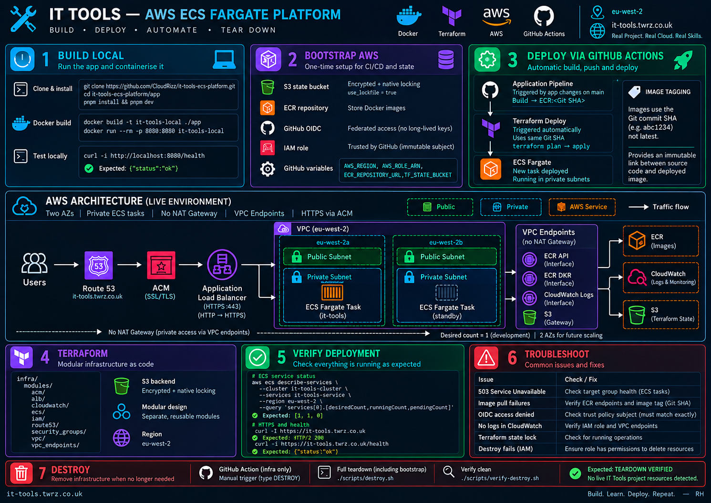
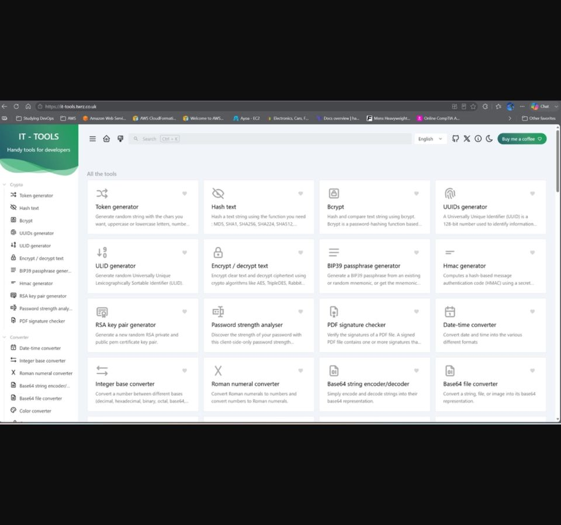
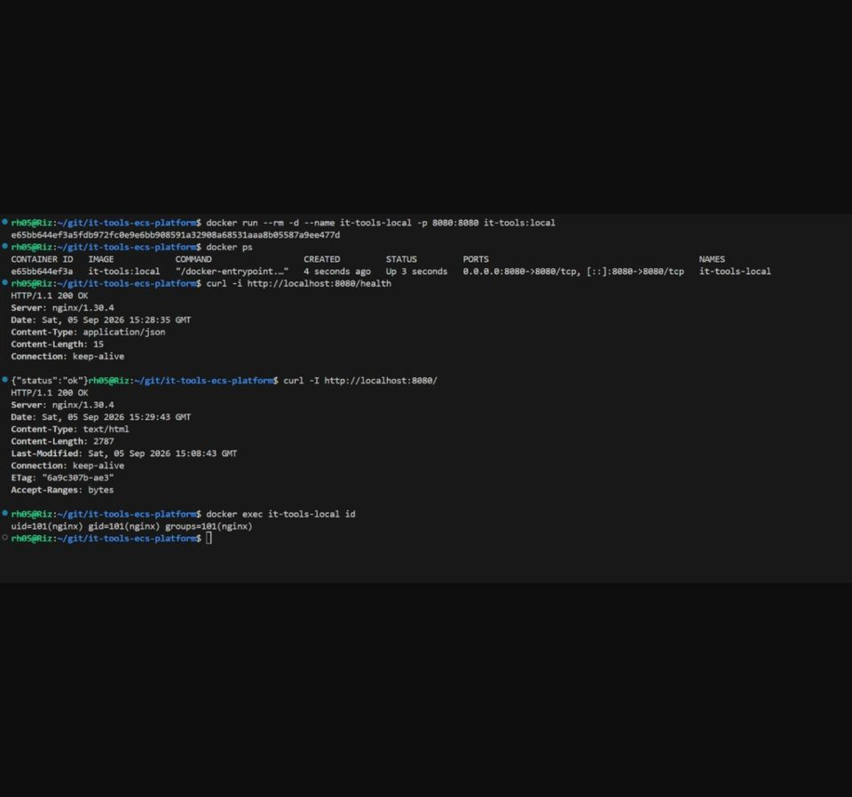
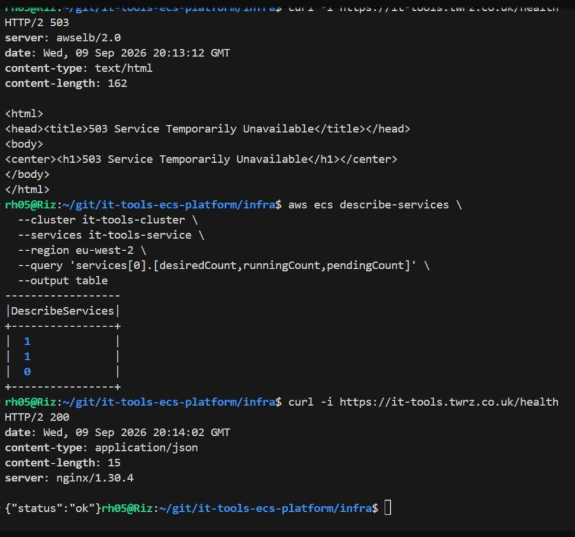

# IT Tools — AWS ECS Fargate Platform

A containerised web application deployed to **AWS ECS Fargate** using **Docker, modular Terraform and GitHub Actions**.

```text
Source → Docker → ECR → ECS Fargate → ALB → HTTPS
```

The application runs in **private ECS tasks** across a two-AZ network, behind an internet-facing Application Load Balancer. Infrastructure is deployed with Terraform and CI/CD uses **GitHub OIDC**, so no long-lived AWS credentials are stored in GitHub.

> **Status:** Successfully deployed, tested and destroyed through GitHub Actions.

---
---

## Project at a Glance



> **Quick reference:** Build → Bootstrap → Deploy → Architecture → Terraform → Verify → Troubleshoot → Destroy

---


## Application Demo

**Application:** `https://it-tools.twrz.co.uk`  
**Health:** `https://it-tools.twrz.co.uk/health`

Expected health response:

```json
{"status":"ok"}
```



---

## Project Overview

### What is IT Tools?

[IT Tools](https://github.com/CorentinTh/it-tools) is an open-source collection of browser-based utilities for developers and IT professionals, including encoders, converters, generators, formatters and networking tools.

I did **not** develop the application itself. My work focuses on the platform around it:

- Docker containerisation
- AWS infrastructure
- networking and security
- Terraform
- CI/CD
- logging and monitoring
- deployment and teardown

### Why did I choose it?

I wanted a real application rather than a hello-world container while keeping the project focused on Cloud and DevOps engineering.

IT Tools is lightweight, easy to containerise, can be served with Nginx and does not require a database. This allowed the project to focus on **AWS, Docker, Terraform, networking and CI/CD**.

### Why ECS Fargate?

I deliberately chose ECS Fargate rather than EC2, Vercel or Netlify.

**EC2** would require additional host management such as operating-system patching, Docker installation and instance maintenance.

**Vercel/Netlify** would be simpler for this application, but would remove most of the container infrastructure I wanted to demonstrate.

Fargate allows me to work with containers, VPC networking, IAM, load balancing and scaling without managing the underlying EC2 hosts.

**Trade-off:** Fargate can cost more than well-utilised EC2 at larger scale.

### Expected Usage

This is a portfolio deployment rather than an application with an established production user base.

The platform spans **two Availability Zones**, but one task means there is currently no task-level redundancy. For the portfolio I onyly ran 1 for the desired count to keep costs low.


```hcl
desired_count = 1
```

For production I would run multiple tasks and add **ECS Service Auto Scaling**, allowing ECS to distribute workloads across the configured Availability Zones where possible, ensuring High Availability. 

---

## Architecture


### Request Flow

```text
Internet
   │
   ▼
Route 53
   │
   ▼
Application Load Balancer
HTTPS :443
   │
   ▼
ECS Fargate Service
Private Subnets
   │
   ▼
Nginx :8080
   │
   ▼
IT Tools
```

| Component | Implementation |
|---|---|
| Region | `eu-west-2` |
| Availability | 2 AZs |
| Network | Custom VPC |
| Public Layer | Application Load Balancer |
| Compute | ECS Fargate |
| Container Registry | Amazon ECR |
| DNS | Route 53 |
| HTTPS | ACM |
| Logging | CloudWatch |
| Private AWS Access | VPC Endpoints |
| Infrastructure | Terraform |
| Terraform State | S3 + native locking |
| CI/CD | GitHub Actions |
| AWS Authentication | GitHub OIDC |

### Network Design

The custom VPC spans:

```text
eu-west-2a
eu-west-2b
```

with a **public and private subnet in each AZ**.

The ALB runs in the public subnets while ECS runs in the private subnets with:

```hcl
assign_public_ip = false
```

This ensures the private subnets stay private. Only the ALB accepts public application traffic.

The project deliberately does **not** use a NAT Gateway. Private ECS tasks access required AWS services through endpoints:

| Service | Endpoint |
|---|---|
| ECR API | Interface |
| ECR DKR | Interface |
| CloudWatch Logs | Interface |
| S3 | Gateway |

This keeps ECS private and avoids NAT Gateway cost, although interface endpoints introduce their own cost and configuration.

### Security

Traffic is restricted using security-group references:

```text
Internet → ALB :443
ALB SG   → ECS :8080
ECS SG   → VPC Endpoints :443
```

HTTP `:80` redirects to HTTPS `:443`.

The existing `twrz.co.uk` Route 53 hosted zone is looked up rather than created by this project. Terraform manages the `it-tools.twrz.co.uk` application record and automatically creates and validates the ACM certificate.

---

## Repository Structure

```text
it-tools-ecs-platform/
│
├── app/
│   ├── Dockerfile
│   ├── nginx.conf
│   └── application source
│
├── bootstrap/
│   └── foundational AWS resources
│
├── infra/
│   ├── backend.tf
│   ├── providers.tf
│   ├── variables.tf
│   ├── outputs.tf
│   └── modules/
│       ├── acm/
│       ├── alb/
│       ├── cloudwatch/
│       ├── ecs/
│       ├── iam/
│       ├── route53/
│       ├── security_groups/
│       ├── vpc/
│       └── vpc_endpoints/
│
├── .github/workflows/
│   ├── app-pipeline.yml
│   ├── terraform-deploy.yml
│   └── terraform-destroy.yml
│
├── scripts/
│   ├── destroy.sh
│   └── verify-destroy.sh
│
└── docs/images/
```

---

## Local Setup

### Application

```bash
git clone https://github.com/CloudRizz/it-tools-ecs-platform.git
cd it-tools-ecs-platform/app

nvm use
corepack enable
corepack prepare pnpm@9.11.0 --activate

pnpm install --frozen-lockfile
pnpm dev
```

Verify:

```bash
curl -I http://localhost:5173
```

### Docker

From the repository root:

```bash
docker build -t it-tools-local ./app

docker run --rm \
  -p 8080:8080 \
  it-tools-local
```

Verify:

```bash
curl -i http://localhost:8080/health
```

Expected:

```json
{"status":"ok"}
```



---

## Terraform

Infrastructure is split into **nine Terraform modules**:

```text
acm
alb
cloudwatch
ecs
iam
route53
security_groups
vpc
vpc_endpoints
```

This keeps networking, compute, security, DNS and supporting services separated rather than maintaining the platform in one large Terraform configuration.

### Remote State

Terraform uses an encrypted S3 backend with **native S3 state locking**:

```hcl
terraform {
  backend "s3" {
    key          = "infra/terraform.tfstate"
    region       = "eu-west-2"
    encrypt      = true
    use_lockfile = true
  }
}
```

The bucket is supplied during initialisation:

```bash
terraform init \
  -backend-config="bucket=$TF_STATE_BUCKET"
```

---

## Bootstrap

Before the main infrastructure can be deployed, `bootstrap/` creates the resources Terraform and GitHub Actions depend on:

```text
S3 Terraform State Bucket
ECR Repository
GitHub OIDC Provider
GitHub Actions IAM Role
```

Run:

```bash
cd bootstrap

terraform init
terraform validate
terraform plan
terraform apply
terraform output
```

The resulting values are configured as GitHub repository variables:

```text
AWS_REGION
AWS_ROLE_ARN
ECR_REPOSITORY_URL
TF_STATE_BUCKET
```

GitHub then authenticates to AWS using:

```text
GitHub Actions
      ↓
GitHub OIDC
      ↓
AWS IAM Role
      ↓
Temporary Credentials
```

No long-lived AWS access keys are required.

---

## CI/CD

Three GitHub Actions workflows manage the platform:

```text
Application Pipeline
        │
        ▼
Docker Build
        │
        ▼
ECR:<Git SHA>
        │
        ▼
Terraform Deploy
        │
        ▼
ECS Fargate
```

### 1. Application Pipeline

Triggered by application changes on `main`.

```text
Checkout
   ↓
AWS OIDC
   ↓
ECR Login
   ↓
Docker Build
   ↓
Docker Push
```

Images are tagged with the **Git commit SHA** rather than `latest`, providing an immutable link between source code and deployed image.

### 2. Terraform Deploy

A successful Application Pipeline automatically triggers Terraform Deploy.

```text
workflow_run.head_sha
        ↓
IMAGE_TAG
        ↓
terraform plan
        ↓
terraform apply
```

The same Git SHA produced by the application pipeline is therefore deployed to ECS.

The workflow runs:

```text
terraform fmt
terraform init
terraform validate
terraform plan
terraform apply
```

### 3. Terraform Destroy

Terraform Destroy is manually triggered and requires inputting:

```text
DESTROY
```

as confirmation.

It removes the main application infrastructure while leaving bootstrap resources available so GitHub can still authenticate and access Terraform state.

---

## Pipeline Evidence

All three required pipelines completed successfully.

### Application Pipeline


### Automatic Application → Terraform Deployment


### All Pipelines


```text
Application Pipeline    ✅
Terraform Deploy        ✅
Terraform Destroy       ✅
```

---

## Deployment Verification

### ECS

```bash
aws ecs describe-services \
  --cluster it-tools-cluster \
  --services it-tools-service \
  --region eu-west-2 \
  --query 'services[0].[desiredCount,runningCount,pendingCount]'
```

Expected:

```text
[1, 1, 0]
```

### HTTPS

```bash
curl -I https://it-tools.twrz.co.uk
```

Expected:

```text
HTTP/2 200
```

### Health

```bash
curl -i https://it-tools.twrz.co.uk/health
```

Expected:

```text
HTTP/2 200

{"status":"ok"}
```



---

## Destroy

The GitHub **Terraform Destroy** workflow removes the main `infra/` stack.

The scripts were created below to ensure a complete teardown to avoid any charges. However they dont need to be used if the application is to be deployed again after terraform destroy.

Run for a complete teardown including bootstrap resources:

```bash
./scripts/destroy.sh
```

Verify the account is clean:

```bash
./scripts/verify-destroy.sh
```

Expected:

```text
TEARDOWN VERIFIED
No live IT Tools project resources detected.
```

---

## Key Engineering Decisions

| Decision | Why |
|---|---|
| ECS Fargate | Containers without EC2 host management |
| Private ECS tasks | Application containers are not directly public |
| ALB | Controlled HTTPS entry point and health checking |
| Two AZs | Multi-AZ network, High Availability and load-balancing foundation |
| No NAT Gateway | No general outbound internet requirement |
| VPC Endpoints | Private access to ECR, S3 and CloudWatch |
| Git SHA image tags | Immutable, traceable deployments |
| GitHub OIDC | No stored AWS access keys |
| Modular Terraform | Clear infrastructure responsibilities |
| S3 remote state | Shared CI/CD state with native locking |

---

## Future Improvements

For a production workload I would add:

- multiple ECS tasks
- ECS Service Auto Scaling
- CloudWatch alarms
- AWS WAF
- automated security scanning
- deployment rollback controls
- a dedicated Terraform plan/security pipeline

---

## Final Result

```text
SOURCE
  ↓
DOCKER
  ↓
ECR
  ↓
TERRAFORM
  ↓
AWS
  ↓
ROUTE 53 + ACM
  ↓
HTTPS ALB
  ↓
PRIVATE ECS FARGATE
  ↓
CLOUDWATCH
```

The project demonstrates a complete container delivery platform using **Docker, AWS, Terraform and GitHub Actions**, from source code through automated deployment to controlled infrastructure teardown.

---

## Author

**Rizwan Hussain**  
Cloud / DevOps Engineering Portfolio  
GitHub: **CloudRizz**

Credit to Corentin Thomasse who created [IT Tools](https://github.com/CorentinTh/it-tools). 